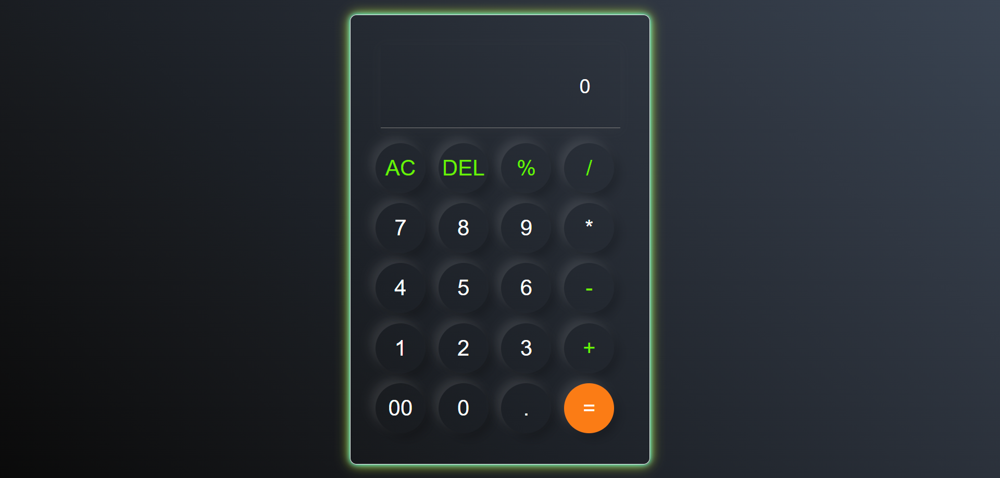

# 🧮Web Calculator

A stylish, responsive calculator built using **HTML**, **CSS**, and **JavaScript** — designed with a glowing neon aesthetic and smooth functionality.

## 📌 Features

- Clear and Delete functionality (`AC` and `DEL`)
- Supports basic arithmetic operations: `+`, `-`, `*`, `/`, `%`
- Responsive layout — works on various screen sizes
- Clean and intuitive UI
- Glowing neon design using CSS shadows

## 🛠️ Tech Stack

- HTML5
- CSS3 (with custom gradients and box-shadows)
- Vanilla JavaScript (DOM manipulation)

## 📷 Preview

---
